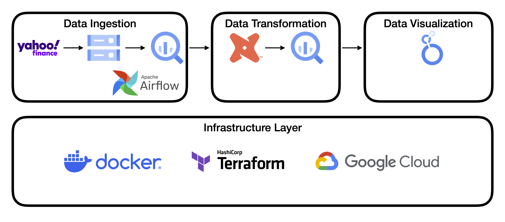
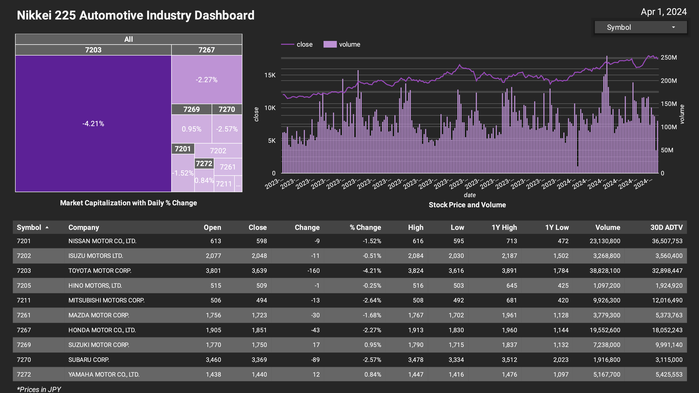

# Nikkei 225 Automotive Industry

## Overview

The Nikkei 225 is considered as the primary stock market index of Japan. It is composed of 225 domestic common stocks selected from the Primary Market of the Tokyo Stock Exchange. These companies are classified into 36 different industries including automotive, retail, and electric machinery[^1]. The Japanese automotive market ranks as the fourth largest in the world. This industry provides a significant share in their GDP at 2.9%[^2]. Currently, there are ten automobile manufacturers listed on Nikkei 225. This project aims to evaluate and analyze the stock performance of these corporations over a one-year period.

[^1]: https://indexes.nikkei.co.jp/en/nkave
[^2]: https://www.trade.gov/country-commercial-guides/japan-automotive

## Problem Statement

The historical data available from Yahoo! Finance only includes open, high, low, close, adjusted close, and volume. Additional metrics are needed to assess the yearly stock market performance of the automotive stocks. This project extracts additional statistics such as market capitalization, 30-day average daily trading volume, and change from the previous closing price. The extracted data can be charted to identify trends and patterns within these companies.

## Technology stack

* **API**: yfinance
* **Cloud**: Google Cloud Platform
* **Infrastructure as Code (IaC)**: Terraform
* **Workflow Orchestration**: Airflow
* **Data Lake**: GCS Bucket
* **Data Warehouse**: BigQuery
* **Data Transformation**: dbt

## Setup Replication

The replication steps are described [here](docs/setup.md). This project uses the Google Cloud Platform to create the VM instance. Terraform is used to provision the Google Cloud Storage bucket and the BigQuery dataset. Airflow requires the docker instance to run.

## Data Pipeline Architecture

The data pipeline can be divided into three parts: data ingestion, data transformation, and data visualization. In data ingestion, airflow orchestrates data collection from the Nikkei 225 website and Yahoo! Finance to be saved in a GCS bucket and a BigQuery dataset. The current list of automotive companies is scraped from Nikkei 225 and fed to the yfinance API to collect their historical data for a year. After a successful run from airflow, data is transformed in dbt Cloud where metrics are extracted. The generated models in dbt creates modified tables in BigQuery which can be loaded to Looker Studio to visualize the data.

## Dashboard

The chart highlights the values found in the data. The treemap displays the current market capitalization along with the percent change from the previous closing price. The line chart shows the daily closing prices of these companies and their corresponding volume. The table summarizes the daily value obtained from Yahoo! Finance and the statistics for a year.

